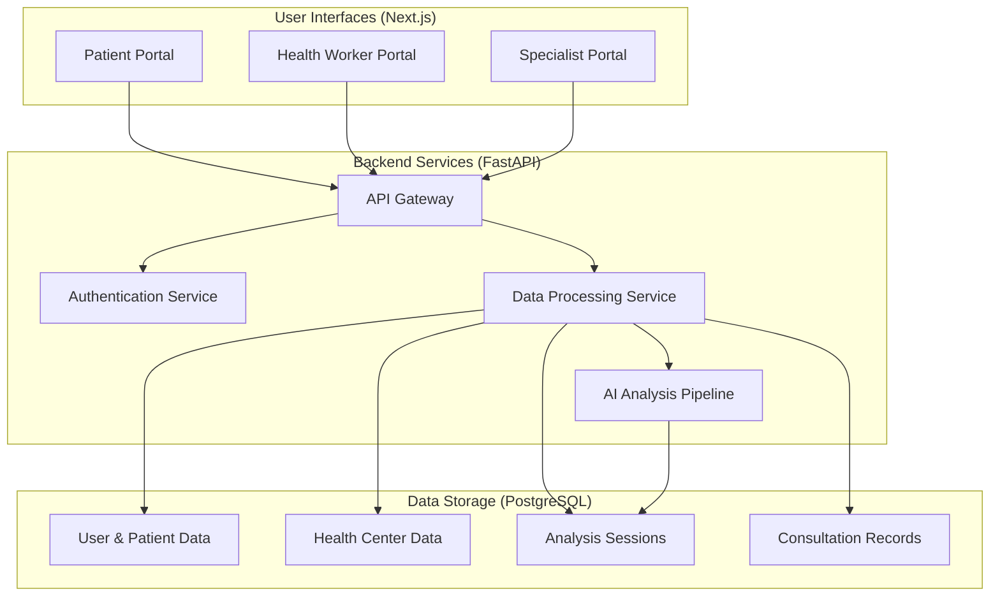

# VitalSense Pro System Architecture

This document provides an in-depth overview of the system architecture for the VitalSense Pro platform. It details the structure of the frontend and backend, the flow of data through the system, and the key design decisions that have been made.

---

## 1. Architectural Overview

VitalSense Pro is built on a modern, decoupled architecture that separates the frontend user interface from the backend business logic. This separation allows for independent development, scaling, and maintenance of the two main components.

---

## 2. Frontend Architecture (Next.js 15)

The frontend is a **server-side rendered (SSR)** application built with Next.js 15. It is organized into three distinct portals, each tailored to a specific user role.

### Key Features:

-   **Three-Portal System**: The application is divided into `patient`, `health-worker`, and `specialist` portals, with role-based access control ensuring that users can only access their designated portal.
-   **Server Components**: Leverages Next.js server components to fetch data on the server, reducing the amount of client-side JavaScript and improving performance.
-   **Custom UI Library**: Utilizes a custom-designed component library built on top of `shadcn/ui` and `Tailwind CSS`, with a focus on creating a clean, professional, and accessible healthcare interface.
-   **State Management**: Uses a combination of React's built-in state management (`useState`, `useEffect`) and server-side data fetching to manage application state.
-   **Authentication**: Implements a client-side authentication flow that interacts with the backend's JWT-based system. User roles and permissions are managed on the client to control access to different portals and features.

---

## 3. Backend Architecture (FastAPI)

The backend is a high-performance API built with Python and FastAPI. It is responsible for handling all business logic, data processing, and communication with the database.

### Key Features:

-   **Modular Routers**: The API is organized into modular routers (`auth`, `upload`, `specialist-analysis`, etc.), making it easy to manage and extend.
-   **Asynchronous Processing**: Built on an ASGI framework, the backend can handle a high volume of concurrent requests, making it suitable for real-time data processing.
-   **ORM and Database**: Uses `SQLAlchemy` as the ORM to interact with the PostgreSQL database, with Pydantic models for data validation and serialization.
-   **AI Integration**: The `mai_dxo_pipeline.py` service integrates with an AI/LLM engine to perform advanced clinical analysis on patient data.
-   **Security**: Implements a robust security model with JWT-based authentication, password hashing, and role-based access control.

---

## 4. Data Flow

The flow of data through the system is a critical aspect of the architecture.

1.  **Patient Registration**: A health worker registers a new patient through the health worker portal. This creates a new record in the `patients` and `users` tables.
2.  **Data Upload**: The health worker uploads vital signs data (ECG, video, etc.) for a patient. The files are temporarily stored, and a new record is created in the `analysis_sessions` table with a status of `UPLOADED`.
3.  **AI Processing**: The backend's data processing service is triggered. It extracts features from the uploaded files, runs the data through the MAI-DxO AI pipeline, and updates the `analysis_sessions` record with the AI-generated risk level and recommendations.
4.  **Specialist Review**: The new analysis session appears in the specialist's queue, prioritized by the AI-calculated risk level. The specialist can then review the data, view the AI's assessment, and add their own notes and diagnosis.
5.  **Consultation**: The specialist's feedback is saved in the `specialist_consultations` table, and the analysis session is marked as `COMPLETED`.
6.  **Patient Access**: The patient can then log in to the patient portal to view the results of their analysis and the specialist's recommendations.

---

## 5. Key Design Decisions

-   **Decoupled Architecture**: Separating the frontend and backend allows for greater flexibility and scalability.
-   **Role-Based Access Control**: A strict RBAC system is implemented to ensure data privacy and security.
-   **Asynchronous Backend**: The use of FastAPI and ASGI allows for high-performance, non-blocking I/O, which is essential for handling file uploads and data processing.
-   **Server-Side Rendering**: SSR with Next.js provides a fast and responsive user experience while also improving SEO.
-   **Modular Design**: Both the frontend and backend are designed with modularity in mind, making it easier to add new features and maintain the codebase. 