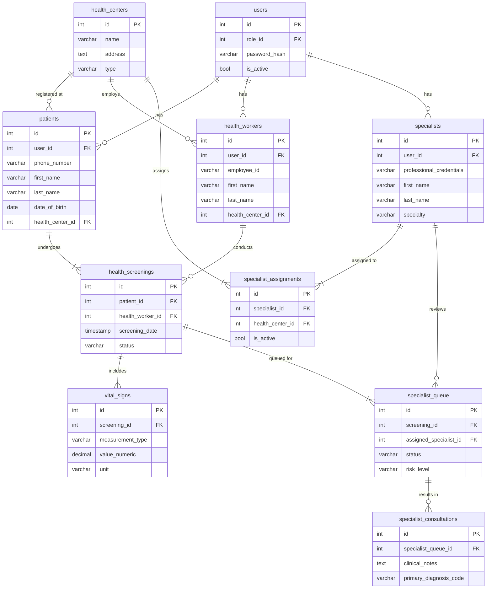

# VitalSense Pro: Database Schema Documentation

This document provides a comprehensive and accurate overview of the PostgreSQL database schema for the VitalSense Pro platform. It is based on the ground truth from the `database_schema.sql` file and provides context for how each table is used within the application.

---

## Schema Overview

The database is designed with a modular, relational structure to securely store user data, patient information, and the results of health analysis sessions.

---

## 1. Core User & Authentication Tables

### `user_roles`
-   **Description**: Defines the different roles a user can have within the system.
-   **Columns**: `id`, `role_name`, `description`

### `users`
-   **Description**: The central table for authentication. Stores login credentials and basic user information.
-   **Columns**: `id`, `role_id` (FK to `user_roles`), `password_hash`, `is_active`, `last_login`

### `user_sessions` & `login_attempts`
-   **Description**: Security tables that track user sessions and login attempts to prevent unauthorized access.
-   **Columns**: `id`, `user_id` (FK to `users`), `session_token`, `ip_address`, `success`

---

## 2. User Profile Tables

### `patients`
-   **Description**: Contains comprehensive demographic and medical information for patients.
-   **Columns**: `id`, `user_id` (FK to `users`), `phone_number`, `first_name`, `last_name`, `date_of_birth`, `health_center_id` (FK to `health_centers`), `allergies`, `medical_conditions`

### `health_workers`
-   **Description**: Stores information about health workers, including their employee ID and assigned health center.
-   **Columns**: `id`, `user_id` (FK to `users`), `employee_id`, `first_name`, `last_name`, `health_center_id` (FK to `health_centers`)

### `specialists`
-   **Description**: Contains detailed information about medical specialists, including their credentials, specialty, and license verification status.
-   **Columns**: `id`, `user_id` (FK to `users`), `professional_credentials`, `first_name`, `last_name`, `specialty`, `medical_license_number`, `license_verified`

### `health_centers`
-   **Description**: Represents the local health facilities (Puskesmas) where patients are registered and health workers are employed.
-   **Columns**: `id`, `name`, `address`, `type`

---

## 3. Health Analysis & Consultation Tables

### `health_screenings`
-   **Description**: The core table that represents a single health analysis session for a patient.
-   **Columns**: `id`, `patient_id` (FK to `patients`), `health_worker_id` (FK to `health_workers`), `screening_date`, `status`, `overall_status` ('healthy', 'attention_needed', 'urgent')

### `vital_signs`
-   **Description**: Stores the individual vital sign measurements collected during a health screening.
-   **Columns**: `id`, `screening_id` (FK to `health_screenings`), `measurement_type`, `value_numeric`, `value_text`, `unit`, `status`

### `specialist_queue`
-   **Description**: Manages the queue of health screenings that are waiting for a specialist to review.
-   **Columns**: `id`, `screening_id` (FK to `health_screenings`), `assigned_specialist_id` (FK to `specialists`), `status`, `risk_level`, `priority_score`

### `specialist_consultations`
-   **Description**: Tracks the detailed feedback, diagnosis, and recommendations from a specialist's review.
-   **Columns**: `id`, `specialist_queue_id` (FK to `specialist_queue`), `clinical_notes`, `primary_diagnosis_code`, `treatment_plan`, `follow_up_required`

---

## 4. Supporting Tables

### `specialist_assignments`
-   **Description**: Manages the assignment of specialists to specific health centers.
-   **Columns**: `id`, `specialist_id` (FK to `specialists`), `health_center_id` (FK to `health_centers`), `is_active`

### `health_reports`
-   **Description**: Stores information about generated health reports (e.g., PDFs).
-   **Columns**: `id`, `screening_id` (FK to `health_screenings`), `title`, `file_path`

### `appointments`
-   **Description**: Manages patient appointments for follow-up consultations.
-   **Columns**: `id`, `patient_id` (FK to `patients`), `appointment_date`, `status`

### `health_recommendations`
-   **Description**: Stores specific health recommendations generated by the AI or a specialist.
-   **Columns**: `id`, `screening_id` (FK to `health_screenings`), `category`, `recommendation_text`, `priority`

### `patient_notifications`
-   **Description**: Manages notifications sent to patients (e.g., appointment reminders).
-   **Columns**: `id`, `patient_id` (FK to `patients`), `title`, `message`, `read_status` 