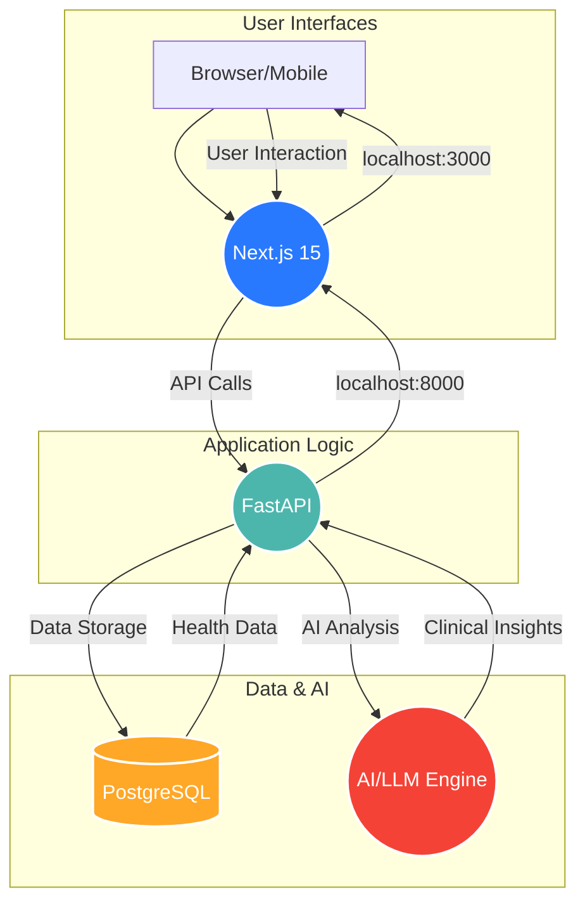

# VitalSense Pro: AI-Powered Multi-Modal Health Analysis Platform

VitalSense Pro is a comprehensive healthcare platform designed to bridge the gap between patients at local health centers and urban medical specialists. It leverages AI-powered vital sign analysis and remote consultation capabilities to provide intelligent health insights and improve patient care.

**✨ Built with custom healthcare UI components and Next.js 15 for modern, responsive healthcare interfaces.**


---

## 🏗️ System Architecture

VitalSense Pro is a distributed full-stack application with a clear separation between the frontend and backend services:



-   **Frontend**: A modern, responsive web application built with **Next.js 15** and a custom-designed healthcare UI component library. It serves three distinct user portals.
-   **Backend**: A robust backend service powered by **Python FastAPI** that handles business logic, API requests, and medical data processing.
-   **Database**: A secure **PostgreSQL** database for storing all patient, user, and health data.
-   **AI Engine**: Integrates with the **MAI-DxO (Multi-Agent Interpretability and Diagnostic Orchestration)** pipeline for advanced AI-powered clinical assessment.

---

## 🚀 Getting Started

### Prerequisites

-   **Node.js**: Version 18 or higher
-   **Python**: Version 3.11 or higher
-   **PostgreSQL**: A running instance (local or cloud)
-   **Git**: For version control

### 1. Clone the Repository

```bash
git clone <your-repo-url>
cd DIGINATION_GRAND-CANYON_UNIVERSITY-OF-SYDNEY
```

### 2. Set Up the Environment

The project includes a convenient script to set up both the frontend and backend environments.

```bash
# This script will:
# 1. Create and activate a Python virtual environment
# 2. Install backend dependencies from requirements.txt
# 3. Install frontend dependencies with npm
#
# Make the script executable first:
chmod +x ./run_app.sh
```

### 3. Configure the Backend

The backend requires a `.env` file for configuration, primarily for the database connection.

```bash
# Create a .env file from the example
cp backend/env.example backend/.env
```

Now, open `backend/.env` and update the following variables with your PostgreSQL credentials:

```ini
DATABASE_URL="postgresql://<user>:<password>@<host>:<port>/<database>"
SECRET_KEY="<your-secret-key>"
ALGORITHM="HS256"
ACCESS_TOKEN_EXPIRE_MINUTES=30
```

### 4. Run the Application

The easiest way to run the entire application is with the provided startup script.

```bash
# This will start both the backend and frontend services concurrently
./run_app.sh
```

Alternatively, you can run the services manually in separate terminals:

```bash
# Terminal 1: Start Backend
source backend_venv/bin/activate
cd backend
python main.py

# Terminal 2: Start Frontend
cd frontend
npm run dev
```

### 5. Access the Portals

Once the application is running, you can access the different portals and services:

| Service               | URL                                            | Description                                  |
| --------------------- | ---------------------------------------------- | -------------------------------------------- |
| **Landing Page**      | `http://localhost:3000`                        | Main landing page for the application        |
| **Patient Login**     | `http://localhost:3000/auth/login/patient`     | Login portal for patients                    |
| **Health Worker Login** | `http://localhost:3000/auth/login/health-worker` | Login portal for health workers              |
| **Specialist Login**  | `http://localhost:3000/auth/login/specialist`  | Login portal for medical specialists         |
| **API Documentation** | `http://localhost:8000/docs`                   | Interactive Swagger UI for the backend API   |

---

## 🔑 Test Credentials

To get started with testing, you can use the following pre-configured accounts for the **Puskesmas Kalumpang** health center.

### Health Worker Account

-   **Portal**: [Health Worker Login](http://localhost:3000/auth/login/health-worker)
-   **Employee ID**: `EMP-KLPG-001`
-   **Password**: `kalumpang123`

### Specialist Account

-   **Portal**: [Specialist Login](http://localhost:3000/auth/login/specialist)
-   **Professional ID**: `PROF-KP-2024`
-   **Password**: `kalumpang123`

---

## 📁 Project Structure

The project is organized into two main directories: `frontend` and `backend`.

```
/
├── backend/                  # Python FastAPI service
│   ├── main.py               # API entry point
│   ├── models/               # SQLAlchemy database models
│   ├── routers/              # API endpoint definitions
│   ├── services/             # Business logic and services
│   ├── schemas/              # Pydantic data schemas
│   ├── utils/                # Utility functions (auth, security)
│   ├── requirements.txt      # Backend dependencies
│   └── Dockerfile            # Docker configuration
│
├── frontend/                 # Next.js 15 application
│   ├── app/
│   │   ├── (portals)/        # Patient, Health Worker, Specialist portals
│   │   ├── api/              # API routes (serverless functions)
│   │   └── layout.tsx        # Main application layout
│   ├── components/
│   │   ├── ui/               # Custom shadcn/ui components
│   │   └── (portals)/        # Portal-specific components
│   ├── lib/                  # Frontend utilities and auth
│   ├── styles/               # Global styles and themes
│   └── package.json          # Frontend dependencies
│
├── .gitignore                # Files and directories to ignore
├── package.json              # Root package for concurrent execution
└── run_app.sh                # Main application startup script
```

---

## 🎯 The Three-Portal System

### 1. Health Worker Portal (`/health-worker`)

-   **Purpose**: Designed for data collection and patient management at local health centers.
-   **Key Features**:
    -   Patient registration and management
    -   Secure upload of vital signs data (ECG, video, etc.)
    -   Symptom and clinical context recording
    -   Dashboard with real-time queue statistics

### 2. Specialist Portal (`/specialist`)

-   **Purpose**: An advanced interface for expert medical review and remote consultation.
-   **Key Features**:
    -   AI-prioritized patient queue based on risk stratification
    -   In-depth data visualization with medical plots and charts
    -   Structured AI assessment panel with tiered recommendations
    -   Tools for diagnosis, consultation, and treatment planning

### 3. Patient Portal (`/patient`)

-   **Purpose**: A user-friendly portal for patients to access their health information.
-   **Key Features**:
    -   View medical history and past analysis results
    -   Access specialist recommendations and treatment plans
    -   Secure and private access to personal health data

---

## 🧠 AI & Data Processing

VitalSense Pro leverages a sophisticated AI pipeline to provide clinical insights:

-   **Signal Processing**: Extracts key clinical metrics from raw vital signs data, such as ECG waveforms.
-   **Video Analysis**: A contactless approach to analyzing respiratory patterns from video feeds.
-   **LLM Integration**: Utilizes Large Language Models (LLMs) for AI-powered clinical assessments and generating diagnostic suggestions.
-   **Risk Stratification**: Automatically prioritizes patients in the specialist queue based on their calculated risk level.
-   **Data Visualization**: Provides interactive charts and waveform displays to help specialists understand patient data.

---

## 🛡️ Security

Security is a core component of the platform, with features including:

-   **Authentication**: JWT-based authentication for all users.
-   **Authorization**: Role-based access control (RBAC) to ensure users can only access appropriate data and features.
-   **Data Security**: Follows best practices for handling sensitive patient data, in line with HIPAA guidelines.
-   **Secure Communication**: Encrypted data transmission between the frontend, backend, and database.

---

## 🔧 Development & Dependencies

### Backend Dependencies

The backend is built with Python and FastAPI. Key dependencies are listed in `backend/requirements.txt` and include:

-   `fastapi`: For building the API
-   `sqlalchemy`: For database ORM
-   `psycopg2-binary`: PostgreSQL adapter
-   `python-jose`: For JWT authentication
-   `passlib`: For password hashing
-   `uvicorn`: ASGI server
-   `wfdb`: For processing vital signs data

### Frontend Dependencies

The frontend uses Node.js and Next.js. Key dependencies are in `frontend/package.json` and include:

-   `next`: The React framework
-   `react`: For building user interfaces
-   `tailwindcss`: For styling
-   `shadcn-ui`: For the component library
-   `lucide-react`: For icons
-   `recharts`: For data visualization

---

## 🔍 Troubleshooting

-   **Page Loads Indefinitely**: This usually means the frontend is running but the backend is not. Make sure both services are running by using `./run_app.sh`.
-   **Authentication Issues**: Ensure your database is running and the credentials in `backend/.env` are correct.
-   **Health Checks**:
    -   Backend: `curl http://localhost:8000/health`
    -   Frontend: `open http://localhost:3000`
